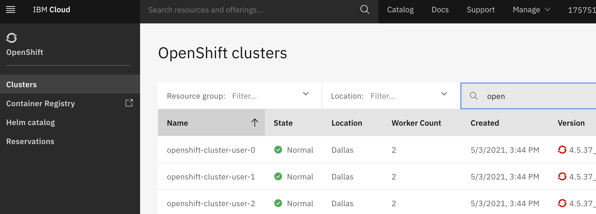
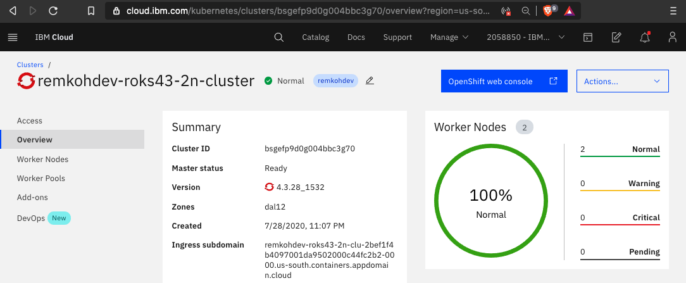

# Connect to RedHat OpenShift Kubernetes Service (ROKS)

## Claiming the Cluster

1. Use the list provided by the instructor to find the name of your Kubernetes cluster.

1. Make sure that you are in the correct account#.

    

    >Note: you may not have access to your OpenShift cluster if you are not in the right account#.

1. Open the Kubernetes cluster link to view all the availbale clusters: [ https://cloud.ibm.com/kubernetes/clusters?platformType=openshift]( https://cloud.ibm.com/kubernetes/clusters?platformType=openshift)

    

1. Locate and click on the cluster that is assigned to you based on step 1.


## Login to OpenShift

1. Click `OpenShift web console` button on the top.

    

1. Click on your username in the upper right and select `Copy Login Command` option.

    

1. Click the `Display Token` link.

    

1. Copy the contents of the field `Log in with this token` to the clipboard. It provides a login command with a valid token for your username.

    

1. Go to the your shell terminal.

1. Paste the `oc login command` in the IBM Cloud Shell terminal and run it.
    
    Output of the login command:
    ```console
    $ oc login --token=nAH06HFM04vlTNNHor3QJ_CMySawfSsV4CNUlwoMUKM --server=https://c115-e.us-south.containers.cloud.ibm.com:30979
    Logged into "https://c115-e.us-south.containers.cloud.ibm.com:30979" as "IAM#rojanjose@gmail.com" using the token provided.

    You have access to 62 projects, the list has been suppressed. You can list all projects with ' projects'

    Using project "default".
    Welcome! See 'oc help' to get started.
    ```

1. Verify you connect to the right cluster.

    ```console
    oc get all
    oc get nodes -o wide
    ```

    Output:
    ```console
    $ oc get all
    NAME                          TYPE           CLUSTER-IP       EXTERNAL-IP                            PORT(S)   AGE
    service/kubernetes            ClusterIP      172.21.0.1       <none>                                 443/TCP   25h
    service/openshift             ExternalName   <none>           kubernetes.default.svc.cluster.local   <none>    25h
    service/openshift-apiserver   ClusterIP      172.21.204.216   <none>                                 443/TCP   25h
   
    $ oc get nodes -o wide
    NAME             STATUS   ROLES           AGE   VERSION           INTERNAL-IP      EXTERNAL-IP    OS-IMAGE   KERNEL-VERSION                CONTAINER-RUNTIME
    10.171.109.110   Ready    master,worker   25h   v1.18.3+cdb0358   10.171.109.110   169.46.60.55   Red Hat    3.10.0-1160.24.1.el7.x86_64   cri-o://1.18.4-11.rhaos4.5.gitfa57051.el7
    10.171.109.113   Ready    master,worker   25h   v1.18.3+cdb0358   10.171.109.113   169.46.60.57   Red Hat    3.10.0-1160.24.1.el7.x86_64   cri-o://1.18.4-11.rhaos4.5.gitfa57051.el7
    ```

1. Optionally, for convenience, set an environment variable for your cluster name.

    ```console
    export CLUSTER_NAME=<your_cluster_name>
    ```

    Output:
    ```console
    $ export CLUSTER_NAME=openshift-cluster-user-0
    ```
